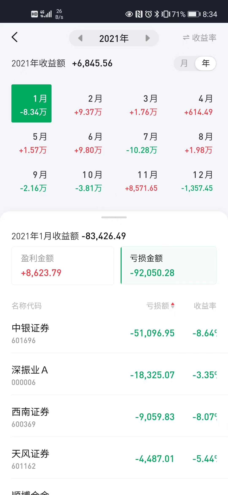
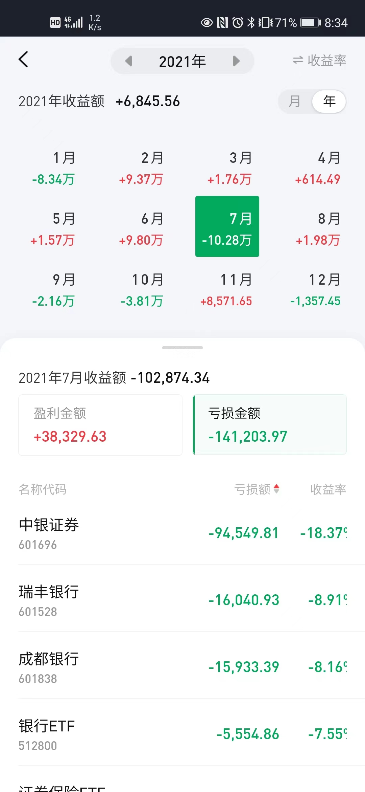
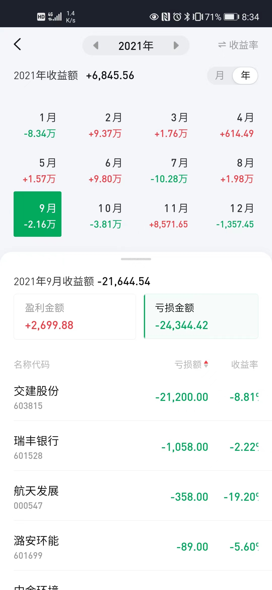
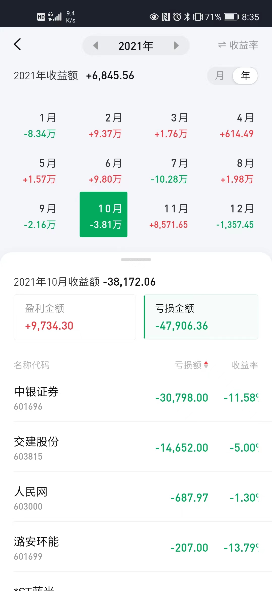

 
 
 

## 麻痹的，不看亏损比例  都不知自己这么有钱的

> 202101持仓
- 中银证券： 59w
- 深振业A： 53w
- 西南证券： 11w

> 202107
- 中银证券： 52w
- 瑞丰银行： 17.7w
- 成都银行： 19w
- yhETF： 7.5w

> 202109
- 交建股份： 24w
- 瑞丰银行： 5w

> 202110
- 中银证券： 27w
- 交建股份： 29w

