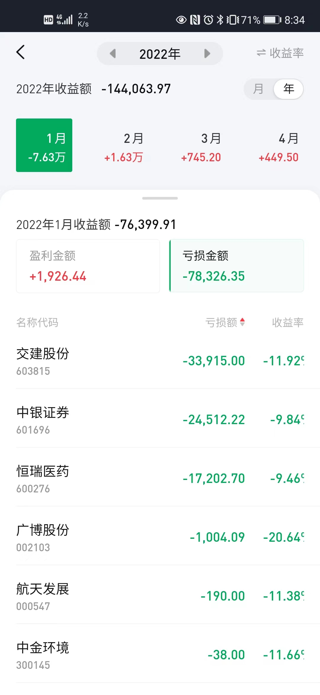
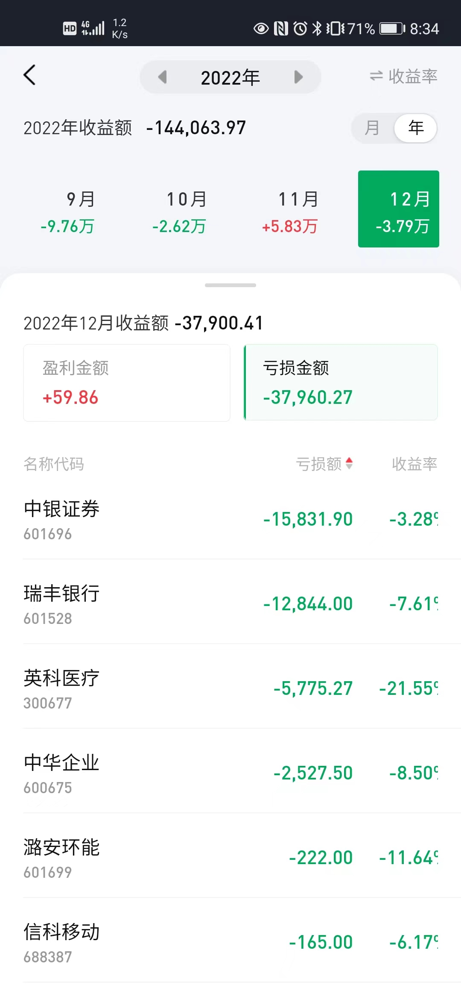

> #### 亏损截图







> #### 复盘查看,主要亏损来源主要是3个个股
>> - 中银证券： 12w左右
>> - 交建股份： 3.4w
>> - 50ETF： 3.2w
>> - 瑞丰银行： 2w左右
>> - 恒瑞医药： 1.7w


</br>

```
2022年9、10、12月份股票大跌，账户看主要是中银证券的亏损；
从8月31--11月24的持仓
这次看问题：
1、没有止损，大跌破位了，起码还有10%的空间；
2、还是没风险意识；
3、杠杆又是亏损的原因，看看资金管理吧；
4、技术不是万能的；
5、卖出太早；
```


交建股份：一月份亏损
买入时间在：2021年8月18日，前两天做T操作，做了-0.5元；
大跌破位了，未止损；

后又在22年2月份-3月份频繁买卖，总体来说这段时间操作是小赚，只是卖的太早；
现在看当时情况，主力不是很强，控盘不稳定；


</br>
</br>
</br>


> 202201持仓
- 交建股份： 28w
- 中银证券： 24.8w
- 恒瑞医药： 17.9w

> 202209持仓
- 中银证券： 58w
- 50ETF： 19w
- 瑞丰银行： 9.2w

> 202210持仓
- 50ETF： 18w
- 瑞丰银行： 8.4w

> 202212持仓
- 瑞丰银行： 9.2w
- 中银证券： 49w


